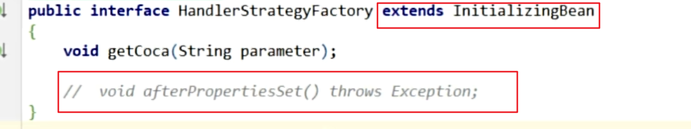
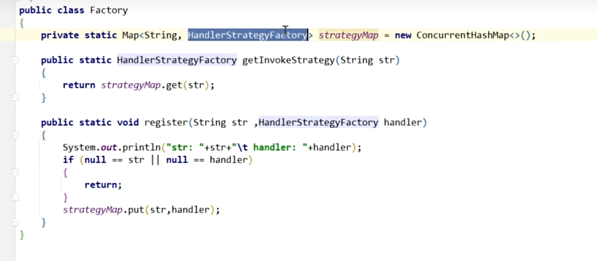
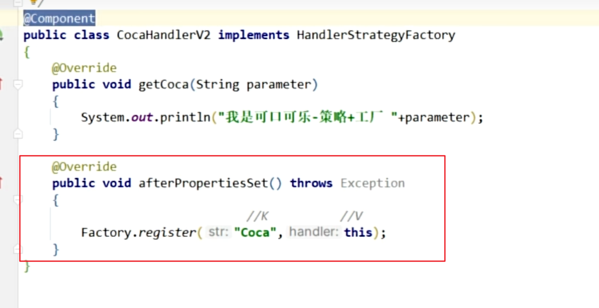

# 支付多渠道模块改造

v1版本是 策略模式 + 简单工厂
```
@Component("ALIPAY") 把对应的支付渠道由Spring管理，自动注入到PaymentStrategyFactory的paymentStrategies Map中。
```


v2版本是 策略模式 + 简单工厂 + 模板方法
```
与v1的区别在于PaymentProcessor是一个抽象类，里面可以定义非抽象方法，用于父类公共方法，子类当然可以重写，其中的抽象方法必须重写。
```


如果想要用静态工厂实现，需要在静态工厂里面定义静态方法 getStrategy(策略标识) 和 register(策略标识， 工厂中Map的Value类型) 

 工厂中Map的Value类型即策略的接口需实现 InitializingBean的 afterPropertiesSet()方法，将实现的策略用静态工厂的register方法注册进去。








